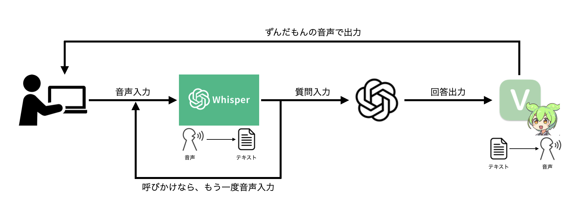

# zundamon_gpt_collab
## TL;DR
「ずんだもんを使ってみたい」「GPTを使ってみたい」「音声入力とかやってみたい」  
 　→ ずんだもんに色々聞いて回答してもらえるものを作りたい！

## 概要図（プロトタイプ）


## 構築環境
- OS : Mac (Sequoia 15.4.1)
- CPU : Apple M1
- VOICEVOX : 0.23.0

## 環境準備
### voicevox engineのインストール
1. build済みのアーカイブを[こちら](https://github.com/VOICEVOX/voicevox_engine/releases)からダウンロード
2. アーカイブを解凍
```bash
$ 7z x voicevox_engine-macos-x64-0.23.0.7z.001

もし7zipがなければ先に以下のコマンドを実行
$ brew install p7zip
```
3. 起動確認
```bash
$ cd macos-x64
$ chmod 755 run
$ ./run

http://localhost:50021/docs でドキュメントが確認できればとりあえずOK
```

## 問題点
- 音声認識の制度とレスポンスの速度のバランスが難しい・・・
- 質問/呼び出し時間を可変にしたりしたい
- whisper部分をAlexa使ってできるようにしたい
